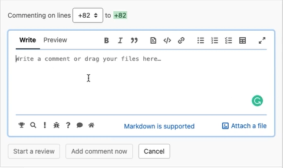

# Conventional Comments button

This is a tiny extension that adds a conventional comment button to GitLab file explorer comments, allowing to quickly leave a structured semantic comment during your MR reviews!

## Demo

## How to install

First, clone this repo `git clone git@gitlab.com:conventionalcomments/conventional-comments-button.git` and then see below for browser specific instructions.

### Chrome

> [!important]
> For GitLab team members, download the published extension from the Chrome Store to stay compliant with GitLab Chrome extensions policy.

This extension is published on the [Chrome Web Store](https://chromewebstore.google.com/detail/gitlab-conventional-comme/hmacdnkefahecfccbjgbjdolhodmnhee?hl=en-US).

Alternatively, you can install an unpacked version by following the steps below:

- On Chrome: Menu
  - Extensions -> Manage Extensions
      - Be sure to have _Developer Mode_ enabled (normally on the top right corner)
      - `Load unpacked` and select the cloned repository

### Firefox

- On Firefox: enter `about:debugging#/runtime/this-firefox` into the address bar
- In the Extension page: `Load Temporary Add-on...` and select any file within the cloned repository

## How to update

- `git pull`

### Chrome

- On Chrome: Menu
  - Extensions -> Manage Extensions
    - Find `Conventional comments button` and hit the refresh button

### Firefox

- On Firefox: enter `about:debugging#/runtime/this-firefox` into the address bar
- In the Extension page find `conventional comments button` and hit the reload button

## How to run it on a self-hosted instance

- Open manifest.json
- Add your domain to `host_permissions` and `content_scripts -> matches`
- Open the browser and install or update the extension

## Credits

This project bundles some of the icon coming from [font-awesome](https://fontawesome.com/) icons as SVG
